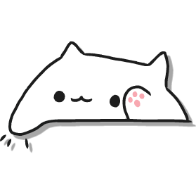

# BongoCatv2

This is a complete rework of the old Bongo Cat mod. Functionality is pretty much the same, but it removes a lot of bloat, and (hopefully) handles a lot of stuff much better.

**Here is a run down of changes that were made.**
- No longer messing with z-order.
> Previous implementations to move Bongo Cat to the top of a scene caused issues with popups, and was overall handled very poorly. Thanks to OverlayManager in Geode v5 this can now be done much cleaner.

- Removing bloat.
> The previous version had a lot of bloat, such as an unlock system, hooking a lot of random stuff to add specific functionality, and overall a messy structure. I have removed the unlock system in order to declutter a lot of this. Additionally, I removed the amount of hooks a lot and instead switched to using Geode-built-in functionality. Not only should this make the code a lot more readable, it should also remove a lot of bugs.

- Overall better code (I hope).
> A lot of the old code was VERY questionable (e.g. getting the node through it's ID every single time), which was messy and straight up bad. I believe I have improved a lot of this in this version.

- Visual improvements.
> Much of the previous art looked quite flat, or had alignment issues. I have reworked all of it to look better.

TL;DR I realize that the previous version of this mod was very poorly done, and I hope that this rework doesn't cause nearly as much issues for devs as the old version did.